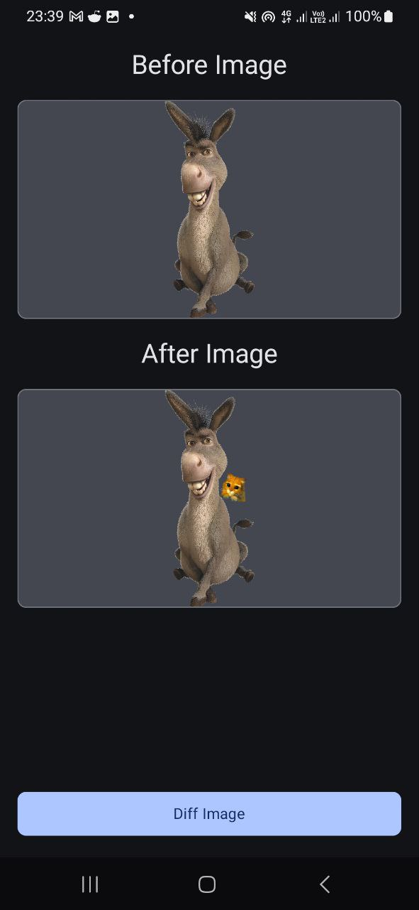
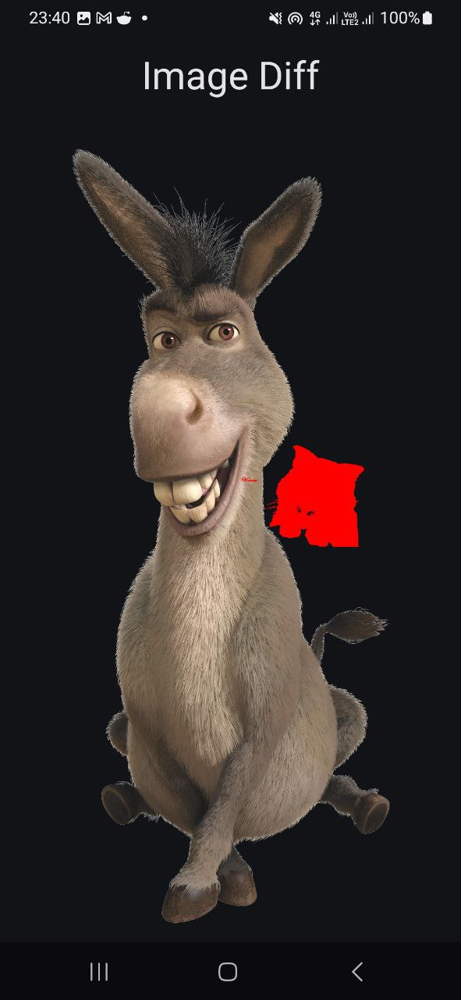

<h1 align="center">Android Odiff</h1></br>

<p align="center">
Android Odiff is an android image diffing library based on the fast image comparision library [odiff](https://github.com/dmtrKovalenko/odiff)
</p>
</br>

<p align="center">
  
  
</p>

## Android Odiff in Android Project
For now, android-odiff exposes a single function only odiff_diff which takes the path of 2 images to compare and the path of the output image
file. The output is automatically saved at the given output path.
```kt
import com.jossephus.android_diff.CDiffOptions
import com.jossephus.android_diff.ODiffLib

val options = CDiffOptions()

val resultCode = ODiffLib.odiff_diff(
    beforePath, // 1st image path
    afterPath, // 2nd image path
    context.cacheDir.resolve("diff_output.png").absolutePath, // ouput path
    options
)
```
You can checkout the sample app in the repo to see how it is used. 

### Including it in your android apps 

[](https://jitpack.io/#jossephus/android-odiff)

1. Make sure jitpack is added to your top level build.gradle.kts
```kt
dependencyResolutionManagement {
		repositoriesMode.set(RepositoriesMode.FAIL_ON_PROJECT_REPOS)
		repositories {
			mavenCentral()
			maven { url = uri("https://jitpack.io") }
		}
	}
```
2. You can now pull android-diff In app level build.gradle.kts using
```kt
implementation("com.github.jossephus:android-odiff:v0.0.2")
```

## Find this library useful? :heart:
Support it by joining __[stargazers](https://github.com/jossephus/android-odiff/stargazers)__ for this repository. :star: <br>
